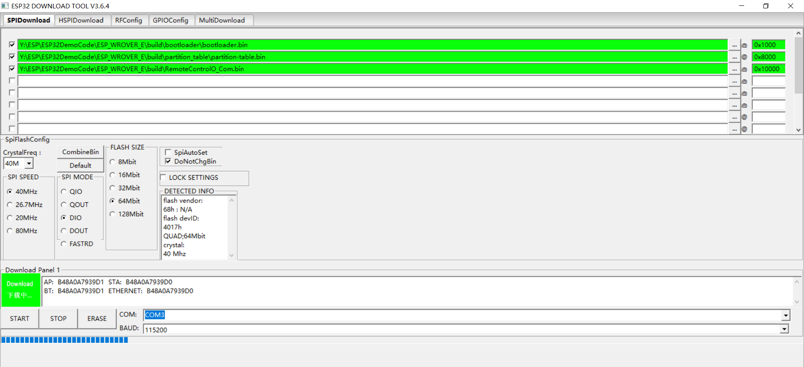

# 用 ESP Flash Download Tool v3.6.4 烧录

适合在 **Windows** 上、已经用 ESP-IDF 编出固件后，不用 `idf.py flash`，改用乐鑫官方图形工具烧录。

工具下载：乐鑫 [Flash Download Tools](https://www.espressif.com/zh-hans/support/download/other-tools)（选 ESPFlashDownloadTool **v3.6.4**）。

---

## 1. 先准备好三个 bin

在工程目录编译一次：

```bash
idf.py set-target esp32
idf.py build
```

编成功后，从 `build/` 取出下面三个文件（路径按本工程）：

| 文件       | 工程内路径                                    | 烧录地址          |
| ---------- | --------------------------------------------- | ----------------- |
| Bootloader | `build/bootloader/bootloader.bin`           | **0x1000**  |
| 分区表     | `build/partition_table/partition-table.bin` | **0x8000**  |
| 应用程序   | `build/RemoteControlO_Com.bin`              | **0x10000** |

本工程 **没有 OTA**，不必烧 `boot_app0.bin`，也不必单独烧 NVS（第一次上电会按代码默认值建参数）。

---

## 2. 本工程 Flash 参数（必须对上）

对应 `sdkconfig` / ESP32-WROVER-E：

| 项         | 取值                   | 工具里怎么选                               |
| ---------- | ---------------------- | ------------------------------------------ |
| 芯片       | ESP32                  | **ChipType = ESP32**                 |
| Flash 大小 | 8MB = 64Mbit           | **FLASH SIZE = 64Mbit**              |
| 模式       | DIO                    | **SPI MODE = DIO**                   |
| 频率       | 40MHz                  | **SPI SPEED = 40MHz**                |
| 晶振       | 40MHz（WROVER-E 常见） | 有**CrystalFreq** 时选 **40M** |
| 分区表偏移 | 0x8000                 | 与下表地址一致即可                         |

工作模式选 **Develop**（开发烧录）。量产多台再改 Factory。

---

## 3. 工具界面怎么填

打开 `flash_download_tool_3.6.4.exe`，芯片选 **ESP32**，进入 **SPIDownload** 页。

### 3.1 勾选三行文件

按顺序勾选并填地址（地址前加 `0x`，不要漏）：

```
☑  …\bootloader.bin              @  0x1000
☑  …\partition-table.bin         @  0x8000
☑  …\RemoteControlO_Com.bin      @  0x10000
```

其余行不要勾。地址填错（例如把 APP 写成 0x0）会起不来。

### 3.2 右侧 SPI 配置

- **SPI SPEED**：40MHz
- **SPI MODE**：DIO
- **FLASH SIZE**：64Mbit

建议勾选 **DoNotChgBin**（不要改 bin 头）。本工程 bin 已是 IDF 按 DIO/40M/8MB 生成的，让工具改头容易和芯片对不上。

### 3.3 串口

- **COM**：设备管理器里的 USB 串口（CH340 / CP2102 等）
- **BAUD**：先试 **115200**（稳）；线好、芯片支持再试 460800 / 921600

点 **START** 前确认没有别的程序占用串口（关掉串口助手、`idf.py monitor`）。

---

## 4. 操作步骤

1. USB 接好板子，装好对应串口驱动。
2. 按 **第 3 节** 勾文件、填地址、选 COM。
3. 让芯片进下载模式（多数板子工具会自己复位；失败再手动）：
   - 按住 **BOOT**
   - 点一下 **RST / EN**
   - 松开 RST，再松开 BOOT
4. 点 **START**，进度条走完出现 **FINISH**。
5. 点一下 RST，或断电再上电，程序开始跑。
6. 用串口助手 **115200 8N1** 看日志，或手机连设备热点打开 `http://192.168.4.1/wsconfig`。

---

## 5. 和 `idf.py flash` 的对应关系

Linux / 本机命令等价于工具里这三行：

```text
芯片  esp32
Flash  dio / 40m / 8MB
0x1000   bootloader.bin
0x8000   partition-table.bin
0x10000  RemoteControlO_Com.bin
```

`idf.py` 默认波特率常为 460800；图形工具烧失败时把 BAUD 降到 **115200**。

---

## 6. 常见问题

| 现象                            | 处理                                                               |
| ------------------------------- | ------------------------------------------------------------------ |
| 一直 Connecting… / SYNC        | 手动 BOOT+RST 进下载模式；换数据线；确认 COM 对                    |
| `Unable to verify flash chip` | 降到 115200；检查供电                                              |
| 烧完不启动、反复复位            | 核对三地址；FLASH SIZE 必须 64Mbit；勾 DoNotChgBin                 |
| 烧完参数全没了                  | 正常：若勾了擦除整片或擦了 NVS（0x9000）。本工程一般只烧三文件即可 |
| 想清空 MQTT/Wi-Fi 配置          | 用网页「复位参数」，或整片擦除后再烧（会丢全部 NVS）               |
| 串口乱码                        | 监视波特率用**115200**，不要跟烧录波特率搞混                 |

**不要**勾选擦除后只烧 APP、漏烧 bootloader / 分区表。
**不要**把 `RemoteControlO_Com.bin` 烧到 `0x0`。

---

## 7. 分区一览（对照 `partitions.csv`）

| 分区        | 偏移    | 大小         | 是否用工具单独烧                 |
| ----------- | ------- | ------------ | -------------------------------- |
| bootloader  | 0x1000  | （bin 自身） | 是                               |
| 分区表      | 0x8000  | —           | 是                               |
| nvs         | 0x9000  | 0x6000       | 否（运行时写入）                 |
| phy_init    | 0xf000  | 0x1000       | 否                               |
| factory APP | 0x10000 | 0x180000     | 是（`RemoteControlO_Com.bin`） |

APP 分区 1.5MB，当前固件约 1.2MB 量级，空间够用。
